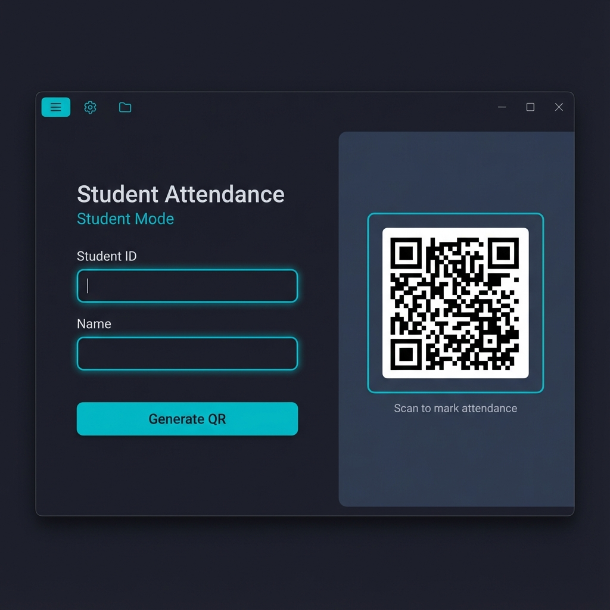
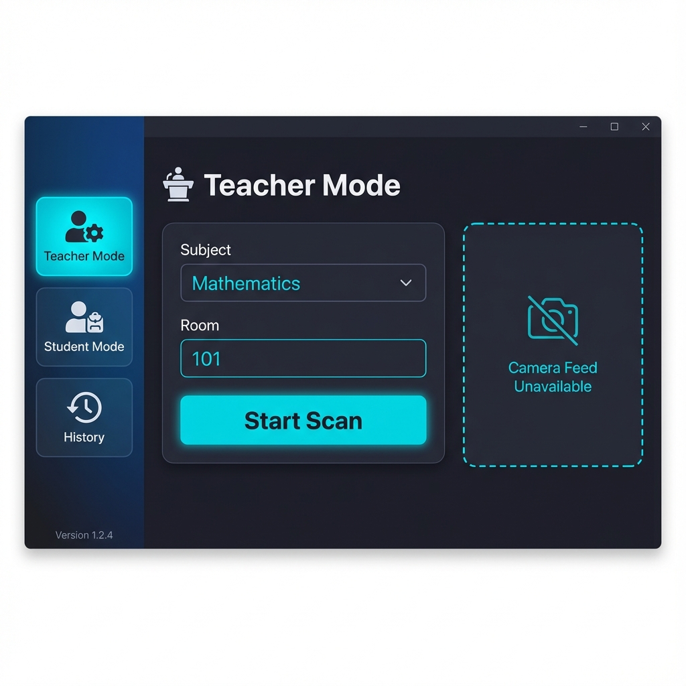
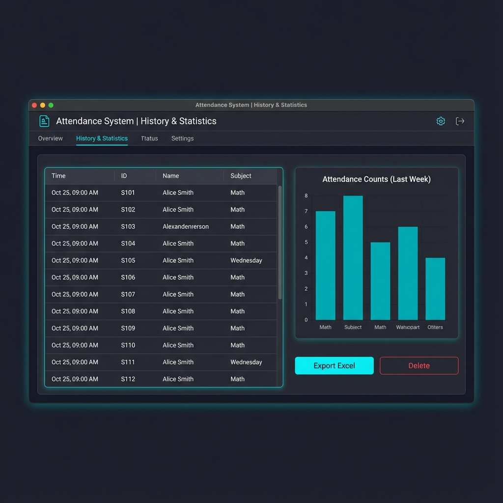

# 📋 Cobalt-Zenith Attendance System (ລະບົບເຊັກຊື່ QR Code)

**ລະບົບເຊັກຊື່ນັກຮຽນອັດສະລິຍະ ດ້ວຍ QR Code (ພັດທະນາດ້ວຍ Python & Tkinter)**

ໂປຣແກຣມນີ້ຖືກອອກແບບມາເພື່ອຊ່ວຍໃຫ້ອາຈານສາມາດຈັດການການເຊັກຊື່ໄດ້ຢ່າງວ່ອງໄວທັນໃຈ ຜ່ານການສະແກນ QR Code ຂອງນັກຮຽນ. ມີລະບົບຈັດການລາຍວິຊາ, ບັນທຶກປະຫວັດ, ແລະ ສ້າງລາຍງານເປັນ Excel ໄດ້ທັນທີ.

---

## ✨ ຟີເຈີຫຼັກ (Key Features)

### 👨‍🎓 1. ໂຫມດນັກຮຽນ (Student Mode)
ສ້າງ QR Code ປະຈຳຕົວຂອງນັກຮຽນໄດ້ງ່າຍໆ ພຽງແຕ່ປ້ອນລະຫັດ ແລະ ຊື່.



*   **QR Generator**: ສ້າງ QR Code ໄດ້ທັນທີ.
*   **Save/Show**: ສາມາດຖ່າຍຮູບ QR Code ເກັບໄວ້ໃນມືຖືເພື່ອໄປສະແກນໄດ້.

### 🎓 2. ໂຫມດອາຈານ (Teacher Mode)
ອາຈານສາມາດຈັດການຫ້ອງຮຽນ ແລະ ເປີດກ້ອງເພື່ອສະແກນໄດ້.



*   **Class Session Management**: 
    *   ເລືອກວິຊາ (Subject) ຈາກ Dropdown (ສາມາດກົດ + ເພື່ອເພີ່ມວິຊາ, ແລະ - ເພື່ອລົບວິຊາ).
    *   ປ້ອນເລກຫ້ອງ (Room Number).
*   **QR Scanner**:
    *   **Start Scan**: ເປີດກ້ອງ Webcam ເພື່ອສະແກນ.
    *   **Upload QR**: ອັບໂຫລດຮູບ QR Code ຈາກຄອມພິວເຕີ (ກໍລະນີນັກຮຽນສົ່ງຮູບມາໃຫ້).
*   **Instant Feedback**: ມີສຽງ ແລະ ຂໍ້ຄວາມແຈ້ງເຕືອນເມື່ອສະແກນສຳເລັດ (ຫຼືແຈ້ງເຕືອນຖ້າສະແກນຊ້ຳ).

### 📊 3. ປະຫວັດ & ລາຍງານ (History & Reports)
ເບິ່ງຂໍ້ມູນຍ້ອນຫຼັງ ແລະ ວິເຄາະຜົນການເຂົ້າຮຽນ.



*   **Daily Log**: ຕາຕະລາງສະແດງລາຍຊື່ຄົນເຂົ້າຮຽນຂອງມື້ນີ້.
*   **Filter System**: ສາມາດຄັດກອງ (Filter) ເບິ່ງສະເພາະວິຊາທີ່ຕ້ອງການໄດ້.
*   **Delete Data**: ສາມາດລົບຂໍ້ມູນທີ່ແຖວທີ່ຕ້ອງການໄດ້.
*   **Export Excel**: ກົດປุ่มສີຂຽວ **"Export Excel"** ເພື່ອດຶງຂໍ້ມູນອອກມາເປັນລາຍງານ (.xlsx) ໄດ້ທັນທີ.

### 📈 4. ສະຖິຕິ (Statistics)
*   **Visual Graphs**: ສະແດງກຣາຟແທ່ງ ປຽບທຽບຈຳນວນການເຂົ້າຮຽນຂອງນັກຮຽນແຕ່ລະຄົນ ໃນແຕ່ລະວິຊາ.

---

## 🛠️ ເທັກໂນໂລຢີທີ່ໃຊ້ (Tech Stack)

ໂປຣແກຣມນີ້ສ້າງດ້ວຍ **Python 3.12+** ແລະ ໃຊ້ Library ດັ່ງນີ້:

| Library | ໜ້າທີ່ (Purpose) |
| :--- | :--- |
| **tkinter** | ສ້າງໜ້າຕາໂປຣແກຣມ (GUI) |
| **opencv-python** | ເປີດກ້ອງ Webcam |
| **pyzbar** | ອ່ານ ແລະ ແປຜົນ QR Code |
| **qrcode[pil]** | ສ້າງຮູບ QR Code |
| **Pillow** | ຈັດການຮູບພາບໃນໂປຣແກຣມ |
| **matplotlib** | ສ້າງກຣາຟສະແດງຜົນ |
| **pandas** | ຈັດການຂໍ້ມູນ ແລະ Export ເປັນ Excel |
| **openpyxl** | ຂຽນຂໍ້ມູນລົງໄຟລ໌ .xlsx |
| **sqlite3** | ຖານຂໍ້ມູນ (Database) |

---

## 🚀 ວິທີການຕິດຕັ້ງ (Installation)

1.  **Clone ໂປຣເຈັກ**:
    ```bash
    git clone https://github.com/yourusername/cobalt-zenith.git
    cd cobalt-zenith
    ```

2.  **ຕິດຕັ້ງ Library**:
    ກະລຸນາຕິດຕັ້ງ Python ກ່ອນ, ຈາກນັ້ນລັນຄຳສັ່ງ:
    ```bash
    pip install -r requirements.txt
    ```

3.  **ລັນໂປຣແກຣມ**:
    ```bash
    python main.py
    ```

---

##  ຄູ່ມືການໃຊ້ງານເບື້ອງຕົ້ນ

1.  **ຕັ້ງຄ່າວິຊາຮຽນ**:
    *   ເຂົ້າ **Teacher Mode**.
    *   ກົດປຸ່ມ `+` ທາງຂວາຂອງຊ່ອງ Subject ເພື່ອເພີ່ມວິຊາ (ເຊັ່ນ: Math, English).
2.  **ສ້າງບັດນັກຮຽນ**:
    *   ເຂົ້າ **Student Mode**.
    *   ປ້ອນລະຫັດ ແລະ ຊື່ -> ກົດ "Create QR".
3.  **ເລີ່ມເຊັກຊື່**:
    *   ອາຈານເລືອກວິຊາ ແລະ ຫ້ອງ.
    *   ກົດ **Start Scan** -> ໃຫ້ນັກຮຽນເອົາ QR ມາສ່ອງທີ່ກ້ອງ.
4.  **ດຶງລາຍງານ**:
    *   ເຂົ້າ **History**.
    *   ເລືອກວິຊາທີ່ຕ້ອງການ -> ກົດ Filter.
    *   ກົດ **Export Excel** ເພື່ອຈົບວຽກ.

---

**ໝາຍເຫດ**: 
*   ຮອງຮັບການສະແດງຜົນພາສາລາວ (Lao Language Support) ດ້ວຍຟອນ **DokChampa**.
*   ທົດສອບບົນລະບົບ Windows (OS Version: windows).
